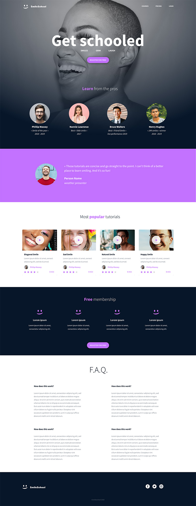

# HTML advanced
In this first project I was asked to construct a website with only HTML - no styling.
The resources such as pictures are found in Figma

The skeletal version of the website should look like this :

## The project was done in these steps below :

- 0. README
- 1. Header
- 2. Banner
- 3. Quote
- 4. Videos
- 5. Membership
- 6. FAQ
- 7. Footer
