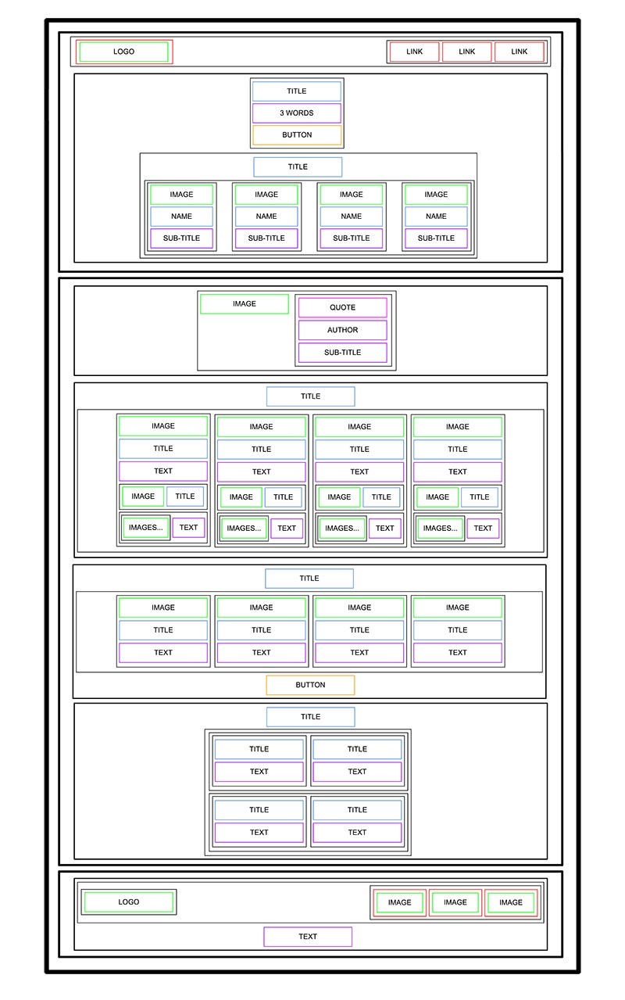

# HTML advanced
In this first project I was asked to construct a website with only HTML - no styling.
The resources such as pictures are found in Figma

The skeletal version of the website should look like this :

## The requiements
- The code must end with a new line
- A "README.md" file is mandatory
- No additional libraries allowed

## All steps to complete the project
0. README and objectives
    - a README file was created (which you are writing it)
1. Header
    - A link with an image
    - A block includong 3 links
2. Banner
    - Block 1 including a title , a text and a button
    - Block 2 including another title with 4 more blocks which contain an image , a title and a sub-title
3. Quote
    - A block of an image and anoter blocks which has blockquote , the text about author and its sub-title
4. Videos
    - A header tag
    - A main block including 4 other blocks which have image , text , title , two other blocks each has an image , text or title
5. Membership
    - A header tag
    - A block including 4 blocks which include an image , text , title
    - A button
6. FAQ
    - A header tag
    - A block containing 2 row blocks
    - Those row blocks have 2 other blocks with their titles and texts
7. Footer
    - A block with an image and another block of 3 links
    - A text at the bottom                        